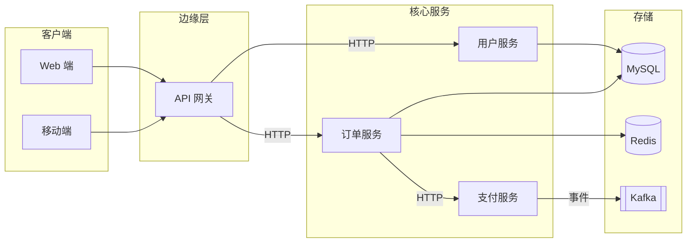

# `lark-uml:architecture`

Specialist skill for **system architecture diagrams** on a Feishu / Lark whiteboard. The agent reads, edits, and writes the board itself through `lark-cli whiteboard`. The final artifact is the updated whiteboard, not a code block.

## Inputs

- `board` — whiteboard URL or `wbcn...` token. Required.
- `task` — what to change this turn. Optional; if empty, this is a first-time initialization and the agent designs the architecture diagram from scratch.
- `language` — `zh-CN` (default) or `en-US`. Diagram-visible text only.

## Workflow

Follow [`../../references/workflow.md`](../../references/workflow.md) end to end. Stay inside the boundaries in [`../../references/boundaries.md`](../../references/boundaries.md). Apply the language rules in [`../../references/language.md`](../../references/language.md). Apply the native connector rules in [`../../references/connectors.md`](../../references/connectors.md).

**Execution route:** raw-first. Read the board as raw, edit native nodes and native connectors, then write raw back. Architecture call / data-flow relationships are business relationships, so every relationship line must be a native connector whose endpoints bind to service, module, storage, gateway, external-system, or boundary node ids. Mermaid may be used only as a private layout sketch; it is not the whiteboard write format.

## Diagram-specific rules

- **Boundaries first.** Every module sits inside a labeled boundary: a system, a tenant, a domain, a deployment zone, a third-party perimeter. Boundaries are `subgraph`s; nested boundaries are allowed up to two levels deep — beyond that, split the diagram.
- **Element vocabulary.** Use a stable set of shapes:
  - Service / module → rectangle.
  - External system / third party → rectangle with a distinct outline (e.g., dashed border).
  - Storage (DB, cache, queue, object store) → cylinder or labeled rectangle marked `DB` / `Cache` / `Queue`.
  - Edge / gateway → trapezoid or a labeled rectangle.
- **Naming granularity.** Names are at the module / service level, not at the class or function level. `订单服务` is correct; `OrderServiceImpl.placeOrder()` is not.
- **Direction = data / call direction.** Every arrow encodes either a synchronous call or a data flow. Choose one notation per relationship and label it (`HTTP`, `gRPC`, `Kafka`, `read` / `write`). Mixed unlabeled arrows are not acceptable.
- **Upstream / downstream.** Upstream sits above (or to the left of) downstream. External traffic enters from one edge, never from multiple unrelated edges. Sync vs async traffic is visually separable — different line styles (solid / dashed) are fine but must be applied consistently.
- **Deployment hint, not deployment manifest.** Architecture diagrams may indicate deployment context (region, cluster, cloud) via boundary labels but should not become Kubernetes YAML. Keep one level of deployment grouping max.

## Forbidden mixings

- Business process steps — those belong in `lark-uml:flowchart` / `lark-uml:swimlane`.
- Use case actors and boundaries — those belong in `lark-uml:usecase`.
- Network connectivity (subnets, VLANs, firewall rules) — that belongs in `lark-uml:network`.
- Class members or methods — those belong in `lark-uml:class`.

## Minimal template

