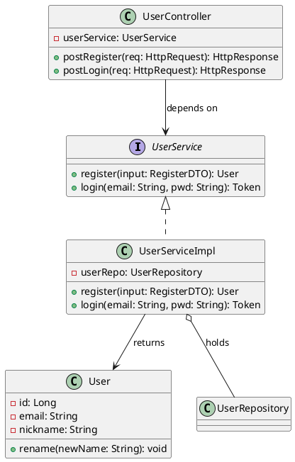

# `lark-uml:class`

Specialist skill for **system-level class diagrams** on a Feishu / Lark whiteboard. The agent reads, edits, and writes the board itself through `lark-cli whiteboard`. The final artifact is the updated whiteboard, not a code block.

This skill is **not** a data-model diagram. For database tables / fields / foreign keys / cardinality, use `lark-uml:er` instead.

## Inputs

- `board` — whiteboard URL or `wbcn...` token. Required.
- `task` — what to change this turn. Optional; if empty, this is a first-time initialization and the agent designs the class diagram from scratch.
- `language` — `zh-CN` (default) or `en-US`. Diagram-visible text only.
- `language_hint` — optional: the project's implementation language (Java / Go / Python / C++ / ...). Shapes the choice of stereotypes (e.g., entity / Service / Controller for Java, struct / interface / service for Go).

## Workflow

Follow [`../../references/workflow.md`](../../references/workflow.md) end to end. Stay inside the boundaries in [`../../references/boundaries.md`](../../references/boundaries.md). Apply the language rules in [`../../references/language.md`](../../references/language.md).

**Preferred source format:** PlantUML.

```bash
cat diagram.puml | lark-cli whiteboard +update <board_token> \
  --source - --input_format plantuml --overwrite --as user
```

## Diagram-specific rules

- **Software-design abstraction, not a data dump.** The diagram captures the main business objects, their attributes, their behaviors, and how they relate at the software-design level. Do not paste database tables in as classes.
- **OO is language-agnostic.** Object-oriented design is a method, not a syntax. The class diagram must abstract away language details; pick a representation that fits the project's actual language:
  - Java → entity classes, Service classes, Controller classes, DTOs.
  - Go → structs, interfaces, business service objects.
  - Python → classes, modules, methods.
  - C++ → classes, abstract base classes, templates (only when they carry real design meaning).
- **Members.** Each class lists attributes (with type) above and methods (with signature) below. Use UML visibility markers: `+` public, `-` private, `#` protected, `~` package.
- **Relationships and their direction.**
  - **Inheritance** — solid line with a hollow triangle arrow head, child → parent.
  - **Realization** — dashed line with a hollow triangle, implementer → interface.
  - **Association** — solid line, with role / multiplicity labels when not obvious.
  - **Aggregation** — solid line with a hollow diamond on the whole side.
  - **Composition** — solid line with a filled diamond on the whole side.
  - **Dependency** — dashed line with an open arrow.
- **Method-level intent.** Beyond data fields, the class diagram **must** carry the project's main business methods and module responsibilities (e.g., `OrderService.placeOrder()`, `PaymentController.handleCallback()`). A class with only fields and no behavior is a sign you are drawing an ER diagram by mistake.
- **Boundary against ER.** Do not include database column types (`VARCHAR`, `BIGINT`), primary / foreign keys, indexes, or storage-layer constraints. Those belong in `lark-uml:er`.

## Forbidden mixings

- Business process steps — those belong in `lark-uml:flowchart` / `lark-uml:swimlane`.
- Sequence messages or lifelines — those belong in `lark-uml:sequence`.
- Deployment topology — that belongs in `lark-uml:architecture`.
- Database table layout — that belongs in `lark-uml:er`.

## Minimal template


