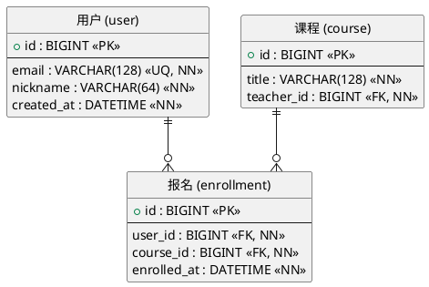

# `lark-uml:er`

Specialist skill for **database relationship (ER) diagrams** on a Feishu / Lark whiteboard. The agent reads, edits, and writes the board itself through `lark-cli whiteboard`. The final artifact is the updated whiteboard, not a code block.

This skill is **not** a software-design class diagram. For business objects with methods, Services, Controllers, inheritance / aggregation / composition, use `lark-uml:class` instead.

## Inputs

- `board` — whiteboard URL or `wbcn...` token. Required.
- `task` — what to change this turn. Optional; if empty, this is a first-time initialization and the agent designs the ER diagram from scratch.
- `language` — `zh-CN` (default) or `en-US`. Diagram-visible text only.

## Workflow

Follow [`../../references/workflow.md`](../../references/workflow.md) end to end. Stay inside the boundaries in [`../../references/boundaries.md`](../../references/boundaries.md). Apply the language rules in [`../../references/language.md`](../../references/language.md). Apply the native connector rules in [`../../references/connectors.md`](../../references/connectors.md).

**Execution route:** raw-first. Read the board as raw, edit native entity/table shapes and native connectors, then write raw back. Foreign-key, cardinality, and table/field relationships are business relationships, so endpoints must bind to the relevant entity or row node ids. PlantUML may be used only as a private schema sketch; it is not the whiteboard write format.

## Diagram-specific rules

- **Entities are tables.** Every entity is a header-rectangle: the table name in the header row, fields stacked underneath. Same-style headers across all entities; same-style rows across all entities; identical column widths within one entity.
- **Field columns.** Each field row shows, in order: field name, type, constraint markers. Constraint markers use the standard set: `PK` (primary key), `FK` (foreign key), `NN` (not null), `UQ` (unique), `IDX` (indexed). One marker per role, no ad-hoc abbreviations.
- **Primary and foreign keys.** Always mark them. A foreign key row must visually point at the referenced primary key — bind the relationship line endpoints to the actual `PK` / `FK` rows, not just to the entity header.
- **Cardinality.** Every relationship line carries cardinality on both ends, written in crow-foot or `1..1` / `1..*` / `0..*` / `0..1` form. Pick one notation per diagram and keep it consistent.
- **Many-to-many.** Always materialize the junction table. Do not draw a single `*..*` line. The junction shows up as its own entity with foreign keys back to both sides.
- **Referential integrity.** Annotate `ON DELETE` / `ON UPDATE` behavior only when it carries meaning (cascade / restrict). Never invent it.
- **Storage-only.** This diagram captures **storage** structure. No class methods, no Service / Controller objects, no business orchestration. Field-level domain logic stays in `lark-uml:class`.

## Forbidden mixings

- Class methods, Service / Controller objects — those belong in `lark-uml:class`.
- Business process steps — those belong in `lark-uml:flowchart` / `lark-uml:swimlane`.
- Actors and system boundaries — those belong in `lark-uml:usecase`.
- Network devices — those belong in `lark-uml:network`.
- Deployment layering — that belongs in `lark-uml:architecture`.

## Minimal template

