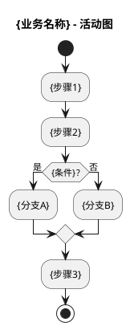

# `lark-uml:flowchart`

Specialist skill for **flowcharts / activity diagrams** on a Feishu / Lark whiteboard. The agent reads, edits, and writes the board itself through `lark-cli whiteboard`. The final artifact is the updated whiteboard, not a code block.

**Two execution routes:**

| Route | Input format | When |
|-------|-------------|------|
| **PlantUML (primary)** | `--input_format plantuml` | First-time creation, clean rebuild, most edits |
| **Raw native (advanced)** | `--input_format raw` | Precise in-place tweak of an existing native board |

Default to PlantUML.

## Inputs

- `board` — whiteboard URL or `wbcn...` token. Required.
- `task` — what to change this turn. Optional.
- `language` — `zh-CN` (default) or `en-US`. Diagram-visible text only.

## PlantUML route (primary)

### Create or replace

```bash
cat << 'PUML' | lark-cli whiteboard +update \
  --whiteboard-token <token> \
  --input_format plantuml --source - \
  --overwrite --as user
@startuml
...
@enduml
PUML
```

Always `--overwrite`. Never put multiple `@startuml`/`@enduml` blocks in one input — run separate calls.

### Activity diagram template



### Conventions

| Rule | Detail |
|------|--------|
| **No background** | Never set `skinparam backgroundColor`. |
| **Single flow** | One start → one stop per diagram. |
| **Decision diamonds** | Use `if`/`else`/`endif`. Every branch labeled in Chinese (`是`/`否`, `通过`/`失败`). |
| **Assume authenticated** | No login-check branches. User is already logged in. |
| **Real names** | Use actual class/method names from source: `CartService.add`, `FruitMapper.selectById`. |
| **Top-to-bottom** | Happy path flows downward. Side branches peel off. |
| **Partition (optional)** | Use `partition "用户端" { ... }` for swimlane-like grouping in activity diagrams. |

### `elseif` constraint (PlantUML)

The Feishu PlantUML parser rejects the `elseif` token. Express multi-way choices as nested `if`/`else`:

```plantuml
if (条件A?) then (是)
  :分支A;
else (否)
  if (条件B?) then (是)
    :分支B;
  else (否)
    :分支C;
  endif
endif
```

## Raw native route (advanced)

Use only when editing an existing native whiteboard whose decision diamonds, merged paths, or custom geometry would be lost by over-writing.

Follow `../../references/workflow.md` with `PlantUML_mode: false`. Native flowchart primitives:

- `composite_shape` `stadium` → start/end
- `composite_shape` `round_rect` → process step
- `composite_shape` `diamond` → decision
- `connector` with `from`/`to` node ids → flow arrow
- Branch labels on `connector.captions`

Pre-write: scan all generated text for `elseif` / `else if`. Either token → rewrite as nested native diamonds before writing.

## Forbidden mixing

- Swimlane responsibility partitions → `lark-uml:swimlane`.
- Sequence messages / lifelines → `lark-uml:sequence`.
- Use case ovals → `lark-uml:usecase`.
- Network devices → `lark-uml:network`.
