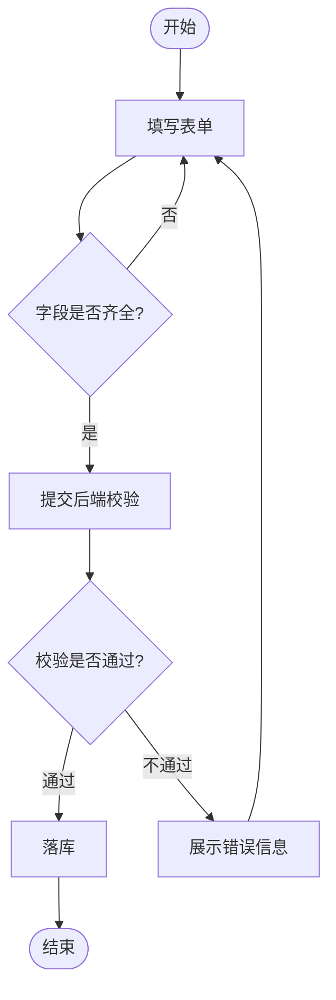

# `lark-uml:flowchart`

Specialist skill for **flowcharts** on a Feishu / Lark whiteboard. The agent reads, edits, and writes the board itself through `lark-cli whiteboard`. The final artifact is the updated whiteboard, not a code block.

## Inputs

- `board` — whiteboard URL or `wbcn...` token. Required.
- `task` — what to change this turn. Optional; if empty, this is a first-time initialization and the agent designs the flowchart from scratch.
- `language` — `zh-CN` (default) or `en-US`. Diagram-visible text only.

## Workflow

Follow [`../../references/workflow.md`](../../references/workflow.md) end to end. Stay inside the boundaries in [`../../references/boundaries.md`](../../references/boundaries.md). Apply the language rules in [`../../references/language.md`](../../references/language.md). Apply the native connector rules in [`../../references/connectors.md`](../../references/connectors.md).

**Execution route:** raw-first. Read the board as raw, edit native flow nodes and native connectors, then write raw back. Step, decision, branch, rollback, and exception arrows are business relationships, so every arrow must bind to source and target node ids. Mermaid may be used only as a private flow sketch; it is not the whiteboard write format.

## Diagram-specific rules

- **Anchored start and end.** Exactly one start node and one end node per primary flow. Start / end use the stadium or circle shape; processing steps use the rectangle; decisions use the diamond. Same role → same shape across the whole diagram.
- **Main flow first.** The happy path is unambiguous and laid out top-to-bottom (or left-to-right) in a single dominant direction. Side branches peel off and either rejoin the main flow or terminate cleanly.
- **Decision branches.** Every diamond has exactly **one** incoming edge and **two or more** outgoing edges. Every outgoing edge carries an explicit branch label written in business language (`是` / `否`, `通过` / `不通过`, `Yes` / `No`). Branches must be mutually exclusive and cover every possible outcome.
- **Merge points.** When multiple branches converge, route them through a merge node (or a clearly labeled junction). Do not drop several incoming arrows onto the same processing step without a visible merge.
- **Rollback and exception paths.** A failure / rollback branch must terminate at a real handler (end node, retry step, or back-into-main with a labeled re-entry). Never leave a branch dangling.
- **Direction discipline.** Arrows follow the dominant flow direction. Explicit backward jumps (retries, loops) must be labeled with the condition that triggers them.

## Forbidden mixings

- Swimlane responsibility partitions — those belong in `lark-uml:swimlane`.
- Use case ovals or system boundaries — those belong in `lark-uml:usecase`.
- Network devices — those belong in `lark-uml:network`.
- Sequence messages / lifelines — those belong in `lark-uml:sequence`.

## Minimal template

