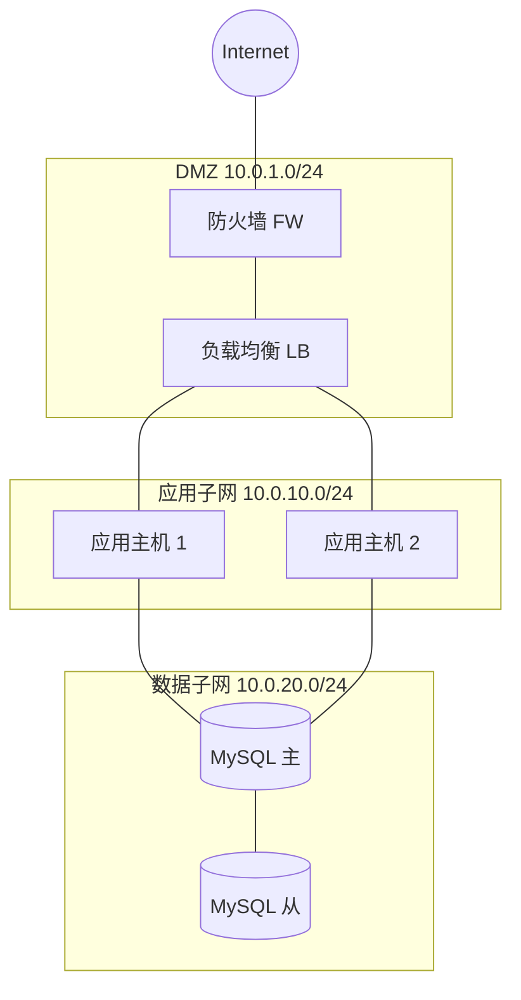

# `lark-uml:network`

Specialist skill for **network topology diagrams** on a Feishu / Lark whiteboard. The agent reads, edits, and writes the board itself through `lark-cli whiteboard`. The final artifact is the updated whiteboard, not a code block.

## Inputs

- `board` — whiteboard URL or `wbcn...` token. Required.
- `task` — what to change this turn. Optional; if empty, this is a first-time initialization and the agent designs the topology from scratch.
- `language` — `zh-CN` (default) or `en-US`. Diagram-visible text only.

## Workflow

Follow [`../../references/workflow.md`](../../references/workflow.md) end to end. Stay inside the boundaries in [`../../references/boundaries.md`](../../references/boundaries.md). Apply the language rules in [`../../references/language.md`](../../references/language.md).

**Preferred source format:** Mermaid `flowchart` with `subgraph` per zone. For richer device iconography, fall back to PlantUML.

```bash
cat diagram.mmd | lark-cli whiteboard +update <board_token> \
  --source - --input_format mermaid --overwrite --as user
```

## Diagram-specific rules

- **Zones first.** Every device sits inside a labeled zone: Internet, DMZ, public subnet, private subnet, VPC, on-prem, partner network. Zones are `subgraph`s with the CIDR range or zone name printed in the header. No "floating" devices outside any zone.
- **Device vocabulary.** Stable shape set:
  - Router / gateway → rectangle labeled `Router` / `GW`.
  - Firewall → rectangle with `FW` label (or a distinct border style if the renderer supports it).
  - Switch / load balancer → rectangle labeled `SW` / `LB`.
  - Host / VM / container → rectangle labeled `Host` / `VM` / `Pod`.
  - Service endpoint → rectangle named after the service.
- **Link semantics.** Lines represent **L2 / L3 connectivity**, not application calls. Annotate the link only with what is true at the network layer: protocol (`TCP/443`, `UDP/53`), port, VLAN, peering relationship. Do not label links with business-level call descriptions — those belong in `lark-uml:architecture`.
- **Direction.** Default to undirected lines for symmetric connectivity. Use arrows only for asymmetric flows (NAT direction, traffic-flow constraints) and label them with the constraint.
- **Uplink / downlink discipline.** External traffic (Internet, partner) sits at the top edge of the canvas; private hosts sit at the bottom. The vertical axis encodes "outside" → "inside". Side-to-side layout is acceptable only when zones are peers (e.g., region-to-region peering).
- **Address detail level.** Include addressing only when the user asked for it (subnet CIDRs, host IPs). Otherwise stay at the device / zone level.

## Forbidden mixings

- Business process steps — those belong in `lark-uml:flowchart` / `lark-uml:swimlane`.
- Use case actors and boundaries — those belong in `lark-uml:usecase`.
- Application-layer call graphs — those belong in `lark-uml:architecture`.
- Database tables — those belong in `lark-uml:er`.

## Minimal template


