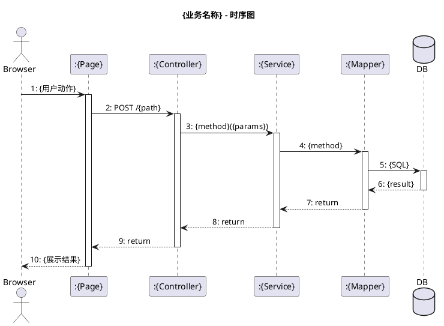

# `lark-uml:sequence`

Specialist skill for **sequence diagrams** on a Feishu / Lark whiteboard. The agent reads, edits, and writes the board itself through `lark-cli whiteboard`. The final artifact is the updated whiteboard, not a code block.

**Two execution routes:**

| Route | Input format | When |
|-------|-------------|------|
| **PlantUML (primary)** | `--input_format plantuml` | First-time creation, clean rebuild, most edits |
| **Raw native (advanced)** | `--input_format raw` | Precise in-place tweak, combined-fragment surgery |

Default to PlantUML. Only use raw when the existing board has complex native fragments that PlantUML would destroy.

## Inputs

- `board` — whiteboard URL or `wbcn...` token. Required.
- `task` — what to change this turn. Optional; if empty, this is a first-time initialization.
- `language` — `zh-CN` (default) or `en-US`. Diagram-visible text only.
- `doc` — optional document URL/token. When provided, the agent also manages the enclosing document structure (callout, table, headings, whiteboard blocks).

## Document co-design (when `--doc` is provided)

When a document token is available, the agent lays out the whole page following this structure:

```
callout ✅ (summary table) + <table> (序号/业务/角色/图示组成)
---
# 1. {业务名称}
  说明段落（仅覆盖该单一动作，不含前后置流程）
  ## 活动图
  whiteboard block
  ## 时序图
  whiteboard block
---
# 2. ...
```

Rules:
- Activity diagram always comes **before** sequence diagram (活动图在前，时序图在后).
- Each section describes **one single focused action** — do not combine multiple business flows.
- Use `docs +update --command overwrite` to write the full document in one pass, creating blank whiteboards via `<whiteboard type="blank"></whiteboard>`.
- Fill each whiteboard separately with `whiteboard +update --input_format plantuml --overwrite`.
- Never put multiple `@startuml`/`@enduml` blocks in one PlantUML input — Feishu parser rejects it.

## PlantUML route (primary)

### Create or replace a board

```bash
cat << 'PUML' | lark-cli whiteboard +update \
  --whiteboard-token <token> \
  --input_format plantuml --source - \
  --overwrite --as user
@startuml
...
@enduml
PUML
```

Always use `--overwrite` for PlantUML writes. Do not attempt incremental plantuml edits — rewrite the whole board.

### PlantUML sequence diagram template



### Key conventions (enforced)

| Rule | Detail |
|------|--------|
| **Actor** | Always `Browser` (not 客户, 用户, User). Represents the user action source. |
| **No background** | Never set `skinparam backgroundColor`. Let the whiteboard use its default. |
| **Lifelines** | Every participant gets `activate` / `deactivate`. Browser is the first to activate and last to deactivate. |
| **Layer order (left-to-right)** | `Browser` → `:Page` → `:Controller` → `:Service` → `:Mapper` → `DB` |
| **Message numbering** | Every label starts with `N: ` (Arabic numeral + colon + space). One continuous sequence top-to-bottom. |
| **Single focused action** | One diagram = one core action. Do not include prep steps (load page, check login) or post steps unless they are part of the single atomic business flow. |
| **Assume authenticated** | No login/not-login alt blocks. The user is already logged in. |
| **Real code names** | Use actual class names from source: `:ClientCartController`, `:CartService`, `:CartItemMapper`. Don't force a `Dao` suffix if the code uses `Mapper`. |
| **SQL labels** | Dao→DB labels use real SQL: `SELECT`, `INSERT`, `UPDATE`, `DELETE` with table names. |
| **Alt / opt** | Use PlantUML `alt`/`else`/`opt` for branches (in-stock vs out-of-stock, exists vs new). Keep guards short. |

### Participant naming

Derive from real source code, preserving the actual class suffix (`Mapper`, `Repository`, `Service`, `Controller`). The colon prefix (`:`) marks a typed participant; omit it for actors.

Standard columns for a backend flow:
```
Browser → :{Page} → :{Controller} → :{Service} → :{Mapper} → DB
```

If a project has fewer layers (e.g., Controller calls DB directly), keep the layer but the message text reflects the real call path. Don't skip columns.

### Combined fragments

Use PlantUML's built-in `alt` / `else` / `opt` / `loop`:

```plantuml
alt 购物车已有
  Svc -> Svc: 累加数量
else 购物车没有
  Svc -> Svc: 新增记录
end
```

- **Causality:** the query/check that produces the guard lives *above* the `alt` block, not inside a branch.
- **Minimal scope:** the `alt` frame only covers the messages that depend on its condition.

## Raw native route (advanced)

Only use when the existing board has native `combined_fragment` nodes, custom geometry, or business-specific decorations that PlantUML over-write would destroy.

### Workflow

Follow [`../../references/workflow.md`](../../references/workflow.md) with `PlantUML_mode: false`. Key steps:
1. `lark-cli whiteboard +query <token> --output_as raw --as user`
2. Edit the raw JSON in memory — rename, move, reconnect, clone native nodes.
3. `lark-cli whiteboard +update <token> --input_format raw --overwrite --as user`

### Native node types (reference)

| Element | Native `type` |
|---------|--------------|
| Participant header | participant head / `life_line` |
| Lifeline | `life_line` |
| Activation bar | narrow `life_line` or `activation` node |
| Message arrow | `connector` with `from`/`to` bound to node ids |
| `alt`/`opt`/`loop` frame | `combined_fragment` |
| Note / annotation | `note_shape` or `text_shape` |

Every business connector must bind to node ids, not coordinate-only endpoints.

## Forbidden mixing

- Swimlane responsibility partitions → `lark-uml:swimlane`.
- Use case ovals or system boundaries → `lark-uml:usecase`.
- Deployment layering → `lark-uml:architecture`.
- Network link topology → `lark-uml:network`.
- Flowchart / activity diagrams → `lark-uml:flowchart` (but they often pair on the same document page — see Document co-design above).
