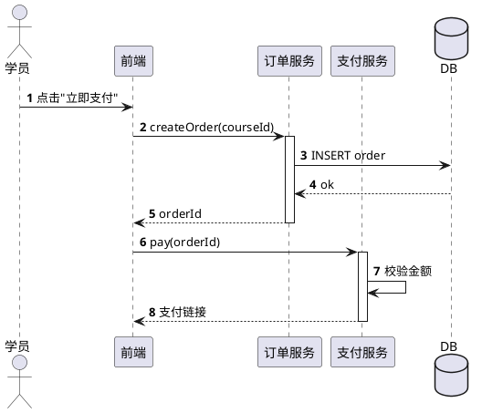

# `lark-uml:sequence`

Specialist skill for **sequence diagrams** on a Feishu / Lark whiteboard. The agent reads, edits, and writes the board itself through `lark-cli whiteboard`. The final artifact is the updated whiteboard, not a code block.

Sequence diagrams are the most layout-sensitive diagram type in this plugin. The rules below are not stylistic — they are correctness gates.

## Inputs

- `board` — whiteboard URL or `wbcn...` token. Required.
- `task` — what to change this turn. Optional; if empty, this is a first-time initialization and the agent designs the sequence diagram from scratch.
- `language` — `zh-CN` (default) or `en-US`. Diagram-visible text only.

## Workflow

Follow [`../../references/workflow.md`](../../references/workflow.md) end to end. Stay inside the boundaries in [`../../references/boundaries.md`](../../references/boundaries.md). Apply the language rules in [`../../references/language.md`](../../references/language.md). Apply the native connector rules in [`../../references/connectors.md`](../../references/connectors.md).

**Execution route:** raw-first. Read the board as raw, edit native participants, lifelines, activations, and native message connectors, then write raw back. Sequence messages are business relationships, so endpoints must bind to participant, lifeline, or activation node ids and remain horizontally aligned. PlantUML may be used only as a private ordering sketch; it is not the whiteboard write format.

## Diagram-specific rules

- **Participant head alignment.** Every participant header (`actor` / `participant` / `object` rectangle) sits on the **same top horizontal baseline**. Identical `y`. Left-to-right ordering. Uniform horizontal spacing. Uniform size. No drifting heads.
- **Lifeline discipline.** Every participant has a vertical lifeline directly below its header. Lifelines are **parallel, strictly vertical, identical length, bottom-`y` aligned**. Each lifeline's `x` is **exactly** the center `x` of its participant header.
- **Messages are horizontal.** Every message connector endpoint is bound to a lifeline (or its participant head). The two endpoints share the **same `y`** (within rendering tolerance). Messages stack top-to-bottom; their `y` coordinates increase monotonically. **No diagonal lines. No freeform polylines. No "point a to point b" geometry that bypasses lifelines.**
- **Self-call.** A participant calling itself draws as a small right-angle loop on the right side of its own lifeline: horizontal out → short drop → horizontal back. Never a long diagonal. Never routed through another lifeline.
- **Activation bar.** The activation rectangle is a narrow strip **centered on the lifeline**, uniform width. It must not overlap the neighbor lifeline. It does not replace the lifeline.
- **Crossings.** A message that visually crosses an intermediate lifeline does **not** change its `y` to dodge — it stays a straight horizontal arrow. Routing tools may render a small jump, but the source `y` is identical at both endpoints.
- **Forbidden constructions.**
  - Drawing a single diagonal connector between two participant heads with no lifelines.
  - Replacing "lifeline + horizontal message" with one point-to-point polyline.
  - Letting an arrow's `y` shift while it crosses other lifelines in the source.
  - Floating activation bars not aligned to any lifeline.

## Forbidden mixings

- Process branches and swimlanes — those belong in `lark-uml:flowchart` / `lark-uml:swimlane`.
- Use case actors with boundaries — those belong in `lark-uml:usecase`.
- Deployment layering — that belongs in `lark-uml:architecture`.
- Network link topology — that belongs in `lark-uml:network`.

## Minimal template

