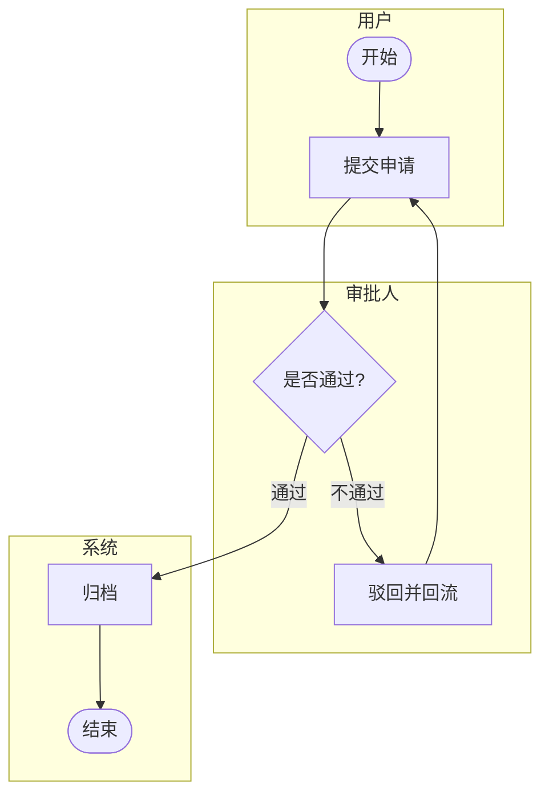

# `lark-uml:swimlane`

Specialist skill for **swimlane diagrams** on a Feishu / Lark whiteboard. The agent reads, edits, and writes the board itself through `lark-cli whiteboard`. The final artifact is the updated whiteboard, not a code block.

## Inputs

- `board` — whiteboard URL or `wbcn...` token. Required.
- `task` — what to change this turn. Optional; if empty, this is a first-time initialization and the agent designs the swimlane from scratch.
- `language` — `zh-CN` (default) or `en-US`. Diagram-visible text only.

## Workflow

Follow [`../../references/workflow.md`](../../references/workflow.md) end to end. Stay inside the boundaries in [`../../references/boundaries.md`](../../references/boundaries.md). Apply the language rules in [`../../references/language.md`](../../references/language.md). Apply the native connector rules in [`../../references/connectors.md`](../../references/connectors.md).

**Execution route:** raw-first. Read the board as raw, edit native lane groups, action nodes, decision nodes, and native connectors, then write raw back. Cross-lane handoffs, branch arrows, and re-entry paths are business relationships, so every endpoint must bind to node ids. Mermaid may be used only as a private swimlane sketch; it is not the whiteboard write format.

## Diagram-specific rules

- **Lane axis.** Organize lanes by role, team, system, or stage. Each lane is one `subgraph`. Lanes flow in one consistent direction (top-to-bottom or left-to-right) — pick one and keep it.
- **Node semantics.** Nodes inside a lane express actions, decisions, or cross-lane handoffs. Decisions are diamonds, actions are rectangles, start / end are stadium / circle shapes — keep the same shape for the same role across all lanes.
- **Responsibility binding.** Every action belongs to exactly one lane. Do not float a node between lanes or stretch a node across a lane boundary.
- **Cross-lane connections.** Cross-lane arrows must explicitly exit one lane and enter another — do not draw "lane-less" floating arrows. Label the arrow with the trigger (event, status, message) when the handoff is not trivially obvious.
- **Exception flow-back.** Failure / rejection paths must explicitly return to their handling lane with a labeled arrow (`失败回流` / `Rolled back` etc.). Do not leave a dangling failure branch.
- **Order discipline.** Stage order within a lane must match the upstream / downstream sequence implied by the cross-lane arrows. No backward jumps without an explicit re-entry label.

## Forbidden mixings

- Use case ovals or actor figures — those belong in `lark-uml:usecase`.
- Network device legends — those belong in `lark-uml:network`.
- Pure deployment layering (web tier / app tier / db tier) — that belongs in `lark-uml:architecture`.
- Class attributes / methods — those belong in `lark-uml:class`.

## Minimal template

