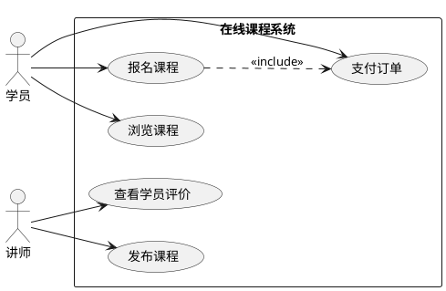

# `lark-uml:usecase`

Specialist skill for **use case diagrams** on a Feishu / Lark whiteboard. The agent reads, edits, and writes the board itself through `lark-cli whiteboard`. The final artifact is the updated whiteboard, not a code block.

## Inputs

- `board` — whiteboard URL or `wbcn...` token. Required.
- `task` — what to change this turn. Optional; if empty, this is a first-time initialization and the agent designs the use case diagram from scratch.
- `language` — `zh-CN` (default) or `en-US`. Diagram-visible text only.

## Workflow

Follow [`../../references/workflow.md`](../../references/workflow.md) end to end. Stay inside the boundaries in [`../../references/boundaries.md`](../../references/boundaries.md). Apply the language rules in [`../../references/language.md`](../../references/language.md). Apply the native connector rules in [`../../references/connectors.md`](../../references/connectors.md).

**Execution route:** raw-first. Read the board as raw, edit native actors, use case ovals, boundaries, and native connectors, then write raw back. Actor associations, include / extend arrows, and generalization relationships are business relationships, so endpoints must bind to actor or use case node ids. PlantUML may be used only as a private relationship sketch; it is not the whiteboard write format.

## Diagram-specific rules

- **System boundary is a rectangle.** All use case ovals **MUST** sit inside the rectangle. All actors **MUST** sit outside. Never put an actor inside the boundary; never put a use case outside.
- **Actor layout.** Actors form vertical columns on the left and / or right side of the boundary. Same-side actors share an exact `x` coordinate; their `y` spacing is uniform. No drifting, no skewed placement.
- **Use case layout.** Inside the boundary, ovals lay out in a tidy multi-column grid or a single vertical column. Row spacing, column spacing, and oval size are uniform — no oversized "hero" ovals, no random rotation.
- **Connection semantics.**
  - Actor ↔ use case: straight association line, no arrow or open arrow head only.
  - Use case ↔ use case: `<<include>>` and `<<extend>>` use dashed arrows with the relationship label written out explicitly.
  - Generalization: solid line with a hollow triangle arrow head.
- **Endpoint binding.** Every relationship endpoint must bind to a real actor `id` or a real use case `id`. No free-floating connector tips.
- **Routing discipline.** Place an actor and its related use cases on the same side of the boundary. Avoid lines that span the entire boundary. Avoid heavy crossings. Multiple lines from the same actor should fan out from a shared anchor instead of leaving the actor on four different sides.

## Forbidden mixings

- Process step lanes — those belong in `lark-uml:swimlane`.
- Deployment node hierarchy — that belongs in `lark-uml:architecture`.
- Network link topology — that belongs in `lark-uml:network`.
- Sequence messages or lifelines — those belong in `lark-uml:sequence`.

## Minimal template

